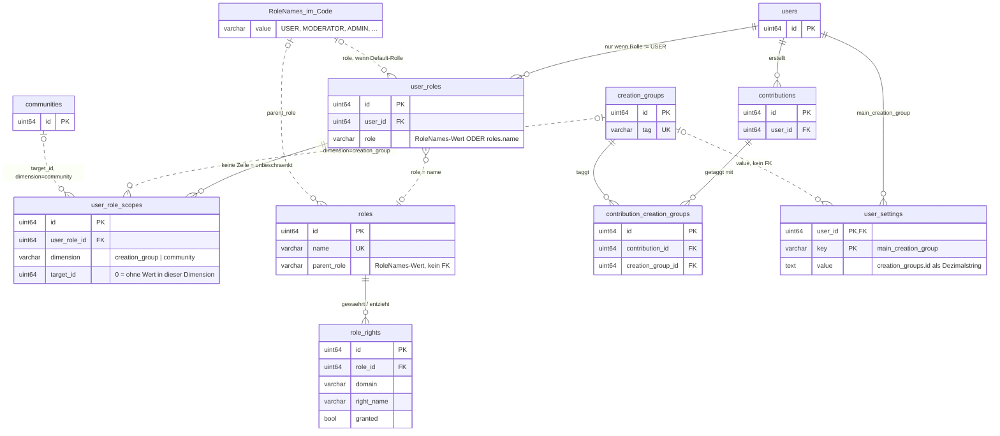

# Gradido2 Architecture

## Scope

Gradido2 is a **rebuild of gradido legacy on a new stack**. No legacy code is carried over,
but the complete feature set of gradido legacy is the target — this is a replacement, not a
subset and not a second product.

`https://github.com/gradido/gradido` remains the behavioral reference for every feature being rebuilt. Where the
intended behavior of a rebuilt feature is unclear, the legacy implementation decides, and
the answer is then written down in `contracts/test-vectors` so it is decided only once.

## Core principle

Gradido2 uses a **reconstructible, session-local working context**.

The database remains the source of truth. The session is a materialized, ephemeral view of the data the current user has already needed.

> RAM may forget. The database must not.
Don't move data to computation when you can move computation to data.

A server restart, session loss, or request being routed to another instance must never make the application incorrect. The missing in-memory state is rebuilt lazily from the persistent source.

The primary optimization is therefore not making database access slightly faster, but **avoiding repeated database work altogether**.

## Why two implementations

Gradido2 exists twice:

- **TypeScript** (bun, ElysiaJS, valibot), as workspaces in `packages/` — the reference implementation. It defines the business behavior.
- **C** (with C++ in leaf modules), in `fast-servers/` — a fast implementation that lazily mirrors the TypeScript side. It is allowed to lag behind.

There are two reasons, and they are different in kind.

### Continuity

The TypeScript path is the answer to "who maintains this if the author is unavailable".
TypeScript developers are easy to find; developers who will maintain an arena allocator and
a lock-free-ish reference-counted session map are not. If that situation ever occurs, the TypeScript path is fixed
and developed further, and the fast path either follows through AI-assisted translation or
freezes without taking the product with it.

Two rules follow, and they are not optional:

- **No feature originates in the fast path.** Behavior that exists only in C silently
  removes itself from the fallback.
- **The fast path must be droppable, not merely removable.** Running without it must
  require no code change: no shared state, no route that exists only there, no role only it
  fills.

The consequence is that the TypeScript path must stay *independently shippable*, including
its own single-binary release. A fallback that cannot produce a release is a specification,
not an insurance policy.

"Fallback" throughout these documents means the path the *project* falls back to, not a
request-level fallback. No request ever moves from one implementation to the other — see
*One implementation per deployment* below.

### Density

Measured in a test project, same pipeline (JWT → PostgreSQL → JSON) on both stacks:

| | CPU per request | RSS |
|---|---|---|
| C on h2o, cached | 11,6 µs | 15 MB |
| Bun + Elysia, tuned, cached | 23,2 µs | 102–125 MB |

The RAM figure matters more than the CPU figure. A Gradido community server should be
hostable by people who are not server administrators, on the smallest hardware that will do
— and there the difference decides whether it runs beside its database at all.

There is a second, structural reason: Bun scales across cores by `SO_REUSEPORT` processes,
each with its own SessionContext map. Eight workers mean eight working sets for the same
users, or sticky sessions — which this architecture rejects. A multithreaded fast server has
one session map across all cores. The session model of this document therefore works fully
only on the fast path.

### One implementation per deployment

A deployment runs **either** the TypeScript path **or** the fast path, never both in front of
the same database. Nothing sits before them splitting routes — no nginx map, no proxy pass by
prefix — and a route the fast path has not implemented is not forwarded to TypeScript. The
server answers `ROUTE_NOT_IMPLEMENTED` (`contracts/errors/api.json`) and the frontend surfaces
the error.

**The reason is the cache, not deployment taste.** The consistency model below rests on an
asymmetry: an own write updates the session in place, because the process that made the change
is the process that holds the session; a foreign write is noticed later through a freshness
marker on the data. Split one user's requests across two implementations and both halves hold
a session for that user, each treating its own writes as precise updates, and neither carrying
a marker the other reads. What that produces is not a cold session — that is acceptable, see
*Multiple instances* — but a warm and wrong one.

Making the mixed case work would mean contracting the cache: shared generation counters, a
shared invalidation channel, one session model implemented identically twice. That is
infrastructure, which `contracts/AGENTS.md` deliberately keeps per implementation, and it
would couple the two paths at exactly the point where their independence is the whole idea.

What does not change is that **the fast path may lag**. Lagging means a deployment on the fast
path serves fewer routes than one on TypeScript, and whoever chose that path chose that. It
never means one deployment serving both.

## Four kinds of code

Not everything is mirrored. Before writing anything, decide which of these it is.

| Kind | Lives | Mirrored |
|---|---|---|
| **Determinism-critical** | once, in C, in `shared-native` | **never** |
| **Single-implementation** | once, in C, in `blockchain-core` | **never** |
| **Protocol-defined** | twice, on a conformant library per language | yes — by the protocol, not by us |
| **Domain / business** | TypeScript reference | yes, C follows |
| **Infrastructure** | each implementation its own | no |

Four reasons can send code into native land, and only three of them are good ones:

```text
performance-motivated   -> no. The crossing costs more than it saves.
determinism-motivated   -> always, whatever it costs.
single-implementation   -> yes, when the alternative is writing a protocol or an
                           algorithm twice and hoping the two agree.
protocol-defined        -> twice, when no one language has the library and the
                           protocol itself is what keeps the halves together.
```

Signing, hashing and transaction serialisation are the second `never`: one C++ library,
`gradido-blockchain-core`, called from both paths. Writing them twice would mean two
implementations of a wire format, and a wire format that two of our own processes disagree
about is not a bug that shows up as a failing test.

`shared-native` is not a performance device. Its purpose is that a computation produces the
same result everywhere. `../gradido/shared-native/src/data/unit.c` carries the evidence: the
decay factor derived from Decimal.js and the fixed-point one differ in the last unit, and
the TypeScript value is commented out. Two implementations of money arithmetic do not
produce different speeds, they produce different amounts.

TypeScript calls into it through N-API with `bigint` at the boundary; the fast server links
the same C directly and pays nothing.

Every piece of logic moved into `shared-native` is a piece that needs no mirror and cannot
diverge. 

`contracts/` covers what remains: constants, schemas, test vectors and API interfaces, in
JSON, tested against both implementations. Automated tests make the gap visible — a failing
or skipped test on the fast path documents a feature that is not implemented there yet.

## Peer discovery

Peer discovery would be the **single-implementation** case above — one protocol, written
once, called from both paths — if there were a language to write it in that both paths can
reach. There is not.

What is needed is not a Kademlia routing table on its own. It is the routing table plus the
transports, the multiplexing, the NAT traversal, the peer store and the identify handshake
that make a node reachable from behind a home router at all. That system exists in exactly
two places: **`rust-libp2p`** and **`js-libp2p`**. A C or C++ implementation is not a binding
one afternoon away — it is the project instead of Gradido.

So peer discovery is mirrored, and it is the **protocol-defined** row of the table above:

```text
packages/dht-node       js-libp2p, TypeScript. The reference path.
fast-servers/dht-node   rust-libp2p, built as a static library behind an
                        extern "C" header and linked like any other native module.
```

Rust is a leaf language here in exactly the sense C++ already is on the fast path: one
module, one `extern "C"` surface, no Rust type crossing the boundary, and no application
logic on the other side of it. What crosses is a peer list and a change notification, not a
libp2p object. The rules are in
[fast-servers/dht-node/Architecture.md](fast-servers/dht-node/Architecture.md).

**Each path runs its own node**, and that is what puts Rust in this repository at all — if
the fast server could read rows a TypeScript process writes, neither this module nor the third
toolchain would exist. It cannot, for the two cases the fast path is *for*. On the small
server a second Node runtime beside the C one spends a whole process's worth of RAM on peer
discovery, which is the figure that decides whether the thing runs beside its database. On the
high-load server, a fast path that needs a TypeScript process to reach the network is not
droppable, only rearranged.

**Two implementations that drift apart do not fail a test — they simply stop finding each
other**, which is why the shared-code answer was the one to prefer and why giving it up needs
saying out loud. What replaces the shared code is that libp2p is a specification with two
conformant implementations, and that both halves speak it because of the specification rather
than because two codebases were kept aligned by hand.

That changes what has to be tested. Contract vectors are the wrong tool: there is no value to
compare, only a behavior between two running processes. The gate is an **interop test** — start
the TypeScript node and the Rust node, have each discover the other and a third peer, and fail
the build if either cannot. It lives in CI beside the contract tests, not in
`contracts/test-vectors`.

It also changes what a version bump means. Two libraries with their own release cycles can
diverge on a protocol detail without either being wrong, so both are pinned, and neither is
raised without the interop test being green on the pair.

**The DHT node does not touch the database.** It discovers peers and reports them; the caller
decides what to persist. Federation rows are written by an Interaction through a Repository,
on whichever path is running — which keeps a network library out of the persistence layer and
the persistence decisions in the domain, where the rest of this document puts them. This holds
on both paths and is the reason the two nodes need no shared state: they hand out the same
kind of answer, and everything that follows from it is domain code that already has a
reference implementation.

The sweep is O(communities) every 20 seconds, which at a few thousand communities is real work
rather than a poll. Both nodes therefore keep the peer state inside the library and report only
what changed — on the fast path so the FFI boundary scales with the number of changes rather
than the size of the network, on the TypeScript path for the same reason at the process
boundary.

Two decisions are settled here rather than per implementation, because settling them
separately is the failure mode.

**Transports: TCP + QUIC, with circuit relay v2 as the fallback.** TCP is the floor and does
not survive a home router without a forwarded port. QUIC does: it reaches an encrypted,
multiplexed connection in one round trip instead of three, and its UDP bindings are what make
hole punching work at all. WebRTC is deliberately not enabled — its two libp2p forms exist to
make a *browser* a peer, and Gradido's peers are community servers; the frontend talks to its
own backend over HTTP and never joins the DHT.

**Bootstrap: one Gradido community URL, `gdd.gradido.net` by default.** libp2p, unlike
legacy's hyperswarm, comes with no public network to join. A fresh community asks a running
community over plain HTTP for a peer list, dials what comes back, and is in. Every community
is a bootstrap node because every community already serves HTTP — no dedicated infrastructure,
no hardcoded addresses to keep alive for a decade. The route is `peer.bootstrap` in
[`contracts/server/backend/peer.json`](contracts/server/backend/peer.json), and it is public
because bootstrapping happens before any handshake exists.

What it returns is a *sample* of peers that are current in the DHT sense — a few different
entry points, not the full set and not the same handful every time, because Kademlia fans out
from wherever it starts. That also keeps the route from being an enumeration endpoint by
construction rather than by promise.

And what it returns is a **hint, not a trust decision**. A peer is verified when it is
contacted, not when it is named: the federation handshake against `communities.public_key`
does that, exactly as before, so a poisoned list costs time rather than trust. The default
being a community we operate makes the ordinary case safe without pretending to be a protocol
guarantee, and the planned hardening — handshake with the bootstrap community first, list
signed — removes the impostor at a hijacked URL without changing that layering.

The reasoning behind both, and what has to be verified before the libraries are pinned, is in
[fast-servers/dht-node/Architecture.md](fast-servers/dht-node/Architecture.md).

## Amounts

Amounts are `bigint` in gdd units, never `number`, on both sides.

```text
add, subtract, multiply   exact in both languages, may be written inline
divide, round, decay,     always through shared-native, in TypeScript and in C alike
parse, format             never reimplemented in either
```

The functions exist: `calculateDecay`, `toDecimalPlaces`, `gradidoUnitFromString`,
`gradidoUnitToString`, `getDecayStartTime`, `getDecayRespiteCent`.

## Portability of the reference implementation

The TypeScript side is written so that translating it stays tractable. These cost nothing
and make the difference between a mechanical port and a rewrite:

- domain data as flat, serializable structures — no class hierarchies, no state captured in
  closures
- IDs instead of object references inside the SessionContext; pointer graphs do not port
- no business outcome that depends on JavaScript semantics: Map iteration order,
  `undefined` versus `null`, implicit coercion
- amounts as above

## Repository layout

```text
packages/          TypeScript — reference implementation
                   every package is @gradido/<directory>; see AGENTS.md section 2
  backend          runnable HTTP server (routes, wiring, startup), and the
                   static server that hands out the frontends a bundled
                   binary carries
  backend-core     backend domain code: data, logic, interactions, repositories
                   plus the database connection, next to the repositories
  bundle           the single binary: which service an argument starts, and
                   nothing else. Its entry point is generated by
                   scripts/bundle.ts because it names every embedded file --
                   see The single binary below
  federation       federation server
  service-core     process infrastructure shared by backend, federation and
                   dht-node: logger, graceful shutdown, environment parsing,
                   retry for things that are not up yet.
                   No HTTP server, no database — see AGENTS.md section 2
  admin            admin frontend
  frontend         user frontend
  frontend-core    UI code shared by admin and frontend
  shared           code shared by frontend and backend: valibot schemas, error
                   codes, units — everything a browser can load. No HTTP server:
                   the routes are in backend and only their type is imported,
                   see HTTP server below
  shared-native    determinism-critical C, called from TypeScript via N-API
                   and linked directly by the fast servers
  email-native     the e-mail templates and the codegen that renders them into C
                   at build time. Both implementations send the same mails
                   because both compile the same generated file — the pug
                   sources here are the single source of truth, and the pug
                   output is checked in as snapshots: the tests hold pug and
                   the addon to them, and every build holds the C binary to
                   them before it hands the generated file to fast-servers.
                   It also compiles fast-servers' message and transport layers,
                   so both paths put the same bytes on the wire; the worker
                   pool above them is the fast path's alone
  dht-node         peer discovery on js-libp2p. Mirrored, not shared — see
                   Peer discovery above

fast-servers/      C — fast implementation, mirrors the domain structure
                   its own Architecture.md holds the C-specific design
                   (plus one Rust module, dht-node, behind extern "C")
  backend
  backend-core
  federation
  dht-node         peer discovery on rust-libp2p, built as a static library
                   behind an extern "C" header. The one place Rust is used,
                   and the one mirrored component with no shared code —
                   its own Architecture.md holds the boundary rules

contracts/         language-independent JSON contracts, see below

docker-compose.yml PostgreSQL, Adminer and a maildev mail sink for
                   development. No gradido2 service runs in a container — see
                   *Development containers* in README.md for why that is
                   deliberate and what it costs to measure through one
```

`packages/contract-tests` is not one of the deployable packages and holds no domain code: it is
the TypeScript half of the vector runners described under *Testing*, and it exists as a package
of its own so that a subject's vectors are run by something that belongs to neither
implementation.

Every folder of TypeScript modules carries an `index.ts` that re-exports it, so a file
reaches its neighbours through barrels — `..` for one level up, `../logging` for a sibling —
instead of naming another folder's files. `AGENTS.md` section 2 has the rule and the two
places it bites: a value imported from `..` closes a cycle through the package index, and a
package root that reaches native code cannot be imported from a browser bundle.

The `-core` packages contain the domain implementation; the packages next to them
are the deployable applications that wire it up. Business code belongs in `-core`.
`service-core` is named the same way but is not one of them: it is infrastructure,
which section *Four kinds of code* keeps per implementation and unmirrored.

Empty directories are intentional. They describe where code belongs once it exists.

## Contracts

`contracts/` is the shared, language-independent description of behavior that both
implementations must satisfy.

```text
contracts/const.json      constants valid for both implementations
contracts/types           shared type/schema definitions
contracts/db              table and column definitions
contracts/server          route definitions: path, method, request, response
contracts/errors          error codes and their meaning
contracts/test-vectors    input/expected-output pairs for both implementations
```

When behavior that both implementations share changes, the contract changes with it.
The contract is a documentation of the TypeScript code, but more important, it is the agreement the
fast path is tested against.

## Testing

- TypeScript: `bun test`
- C: google test
- Rust: `cargo test`, for `fast-servers/dht-node` only
- Contract tests read `contracts/` and run the same vectors against both implementations —
  `packages/contract-tests/` is the TypeScript runner, `fast-servers/tests/contract/` the C one,
  and neither is the authority: the file is. `contracts/AGENTS.md`, *test-vectors*, holds the
  shape; `contracts/test-vectors/jwt.json` is the worked example, and it is also where a
  disagreement the two cannot resolve today is written down rather than left out
- Database tests run against both PostgreSQL and SQLite
- One interop test, outside `contracts/`: the js-libp2p node and the rust-libp2p node
  discover each other and a third peer. It is the only gate on the one mirrored component
  that no contract vector can cover — see *Peer discovery*.

A missing feature on the fast path should surface as a failing or explicitly skipped contract
test, not as silence.

## Session as working context

After the AppContext, the SessionContext is the main object passed as a parameter
into business functions.

It holds the working set currently useful to one user, for example:

- every JWT this session has been issued — what a request is compared against instead of
  having its signature verified, see *Session cache*
- the authenticated user with contact data, role(s) and permissions
- transactions, contributions, transaction_links, contribution_links, contribution_messages that have already been loaded
- the last known id of those tables at the time they were selected, so it can be compared against the id in the AppContext and refreshed when that data is requested again
- other data the current interaction/session needs repeatedly

Data is loaded **lazily**, when needed.

The session should have a bounded working set so that one unusual request cannot turn it into an accidental copy of a large part of the database.

The session stores its creation time — `session_created_at`, which every token of it carries
— and is dropped `SESSION_HARD_TIMEOUT_MS` (10 minutes) after it, whatever it is doing. This
is a backstop against cache-invalidation bugs: even a session that missed an update cannot
stay wrong for long. Refreshing the login does not move it; see *Tokens and the login*.

## Session cache

Both implementations hold sessions the same way, and two decisions carry the rest of it.

**The token carries the slot its session sits in, so a lookup is an array read.** There is no
key to hash, so there is no collision, no probe walk, no full-store case that costs anything,
and none of the silent hit-rate collapse that a cache suffers when the keys it routes on can
be chosen from outside. The measurements that argued the earlier designs away are in
[fast-servers/Architecture.md](fast-servers/Architecture.md#session-cache) and are not
repeated here.

**A session keeps every token it has been issued, so a hit costs a comparison instead of a
signature check.** So the store is asked *first*, with the claims read but not yet vouched
for, and the signature is verified only when the store answers nothing — on the path that was
going to create a session anyway:

```text
parse the claims, verifying nothing: session_created_at, user_uuid, slot
now - session_created_at < SESSION_HARD_TIMEOUT_MS   else -> verify
slot < the slots that exist                          else -> verify
the slot holds a session                             else -> verify
that session is itself inside the hard timeout       else -> verify
its user_uuid equals the claim                       else -> verify
the token is one of the tokens that session was given -> hit

verify: check the signature, the claims and exp, then create a session and mint a token
```

What that is worth, measured on the reference path — Ryzen 7 5700G, bun 1.3.14,
`packages/service-core`:

```text
1051 ns  base64 decode + JSON.parse of the payload   both paths pay this
 281 ns  the claims through their valibot schema     both paths pay this
   6 ns  bounds check, array read, two comparisons   the hit path, all of it
 852 ns  HMAC-SHA256 verify                          the miss path only
```

**The signature is the smaller half of what a hit saves, and the honest reason to look first
is the other half:** a miss does not merely verify, it loads a user, its roles and its first
page of data to build a session with. On the fast path those are two queries and 37 to 48 µs
before anything is answered — see
[fast-servers/Architecture.md](fast-servers/Architecture.md#where-a-querys-time-goes) — which
is fifty times the microsecond this ordering saves on the token itself.

The claims are read through a schema — `sessionClaimsSchema`, valibot, in
`packages/service-core/src/session/input.schema.ts` — rather than by hand, and
that is not tidiness: it is where *a claim that is absent is not a claim that passed* stops
being a rule someone has to remember. A missing `slot` becomes a miss instead of slot 0, a
`user_uuid` that is not a uuid never reaches the store, and the wire's `snake_case` meets the
code's `camelCase` in exactly one place. Nothing downstream repeats those checks: what is
typed as the schema's output has been through it, which is why the store asks only what the
schema cannot know — whether the slot is one it has already handed out. Both implementations
have to reject the same payloads, which makes this a candidate for the first entry in
`contracts/test-vectors`.

The rule that makes the second decision safe is one line, and every step above keeps it:

> **Nothing an unverified token says is trusted as data.** The claims select a candidate;
> every decision is made against what the store itself holds.

A token is accepted because it is byte-identical to one this process minted and still holds.
That is what the signature would have proven, established by equality rather than by
arithmetic — and it is why the token comparison is last rather than first: the cheap
comparisons before it only narrow the search. Two consequences are worth naming. Tokens in
memory are credentials, so they are never logged (`contracts/logging.json` already says so)
and never handed to anything but a comparison. And a session that is gone takes its tokens
with it: after a restart, on another instance, or ten minutes on, the only way in is the
signature. Ending a session ends every token of it at once, which is what makes logout and
revocation work at all; what a rotated signing key cannot do is invalidate anything faster
than the hard timeout.

The claim's age is checked first because it is free and keeps a long-dead token off the store
entirely, but it is not what makes the timeout hold — the session's own creation time is,
because it is the one this process wrote. The two differ in exactly one case, a session that
has timed out while expiry has not yet reached its slot, and that case is the reason both
checks exist.

### Tokens and the login

```text
slot, user_uuid, session_created_at   the session's identity; a re-issued token
                                      copies all three, unchanged
iat, exp                              the token's own, in seconds because RFC 7519
                                      says so; session_created_at is unix
                                      milliseconds like every other time here
```

A token is valid for `JWT_TOKEN_EXPIRATION_MS` from the moment it was issued, and a request
gets a fresh one only once the newest token of its session is older than
`JWT_TOKEN_REISSUE_AFTER_MS`. The login therefore slides in whole minutes rather than on every
request, and ends between 29 and 30 minutes after the last one.

**The session does not slide with it.** A re-issued token copies `session_created_at`, so the
hard timeout keeps counting through any number of refreshes — which is what makes it a
backstop against cache-invalidation bugs rather than a login timeout. A token that could stamp
itself afresh would keep a stale working set alive indefinitely, and the backstop would be
worth nothing.

Whether a token is due for re-issue is decided from the store's clock and never from the
token's own `iat`, and that is not pedantry: `iat` is unverified on this path, and believing
it would let whoever writes the token decide how many tokens a session accumulates. With the
interval enforced by the store, a session holds `SESSION_HARD_TIMEOUT_MS /
JWT_TOKEN_REISSUE_AFTER_MS + 1` of them at most — eleven, a few kilobytes beside a working set
measured below in tens.

`exp` is not checked on the hit path, and does not need to be: a token in a live session's set
was issued no earlier than that session began, the session is younger than ten minutes, and
thirty is longer than ten. On the verify path it is checked like every other claim, and a
claim that is absent is not a claim that passed.

### Expiry, and how big the store gets

Sessions are created in time order and each dies exactly `SESSION_HARD_TIMEOUT_MS` after it
was created, so their slots, kept in creation order, expire from the front. Whoever creates a
session releases everything at that front that has timed out — a burst at once, not one per
insertion — and then takes one of the slots that just came free. Expiry is therefore a
comparison at one known position: no sweeper, no timer, nothing on the read path, and nothing
running when nobody is asking.

**How many sessions live at once is not a number this design wants to be told.** It is the
number created within one hard-timeout window, it depends on the community and the hour of
the day, and the store finds it by itself: it appends a slot when it has none free and reuses
the slot of every session that ends. What it settles at is the load, and it stays there.

Three structures, because one is not enough once slots are reused:

```text
slots   the sessions. Appended to, never reordered: a slot number that went out
        inside a token has to keep meaning what it meant.
order   the slots in creation order — what expiry walks. It cannot be read off the
        slots themselves, because a reused slot is out of turn.
free    slots whose session is gone, ready to be handed out again.
```

**The configured maximum is a crash guard, not a sizing decision.** Below it nothing is ever
retired early. At it, the oldest session is retired to make room — its owner's next request
is one miss, one verification and a fresh session, and `session.context.evicted` is the line
that says the store was not allowed to grow to the load it actually has. What it protects
against is a load nobody planned for taking the process down instead of the request.

**The number itself is open, and it is a memory question rather than a session one.** The
figures under *The working set* are the C path's; a session in V8 costs a multiple of them,
and neither is measured. What settles it is an experiment rather than an estimate: put a load
on one instance that fills the store, and read the process's resident memory against the two
numbers the store reports — how many sessions are alive, and how many slots it has ever
needed. Bytes per session is the slope of that, and the ceiling is the memory a machine can
spare divided by it, with room left over. Until then the honest configuration is a number
that is obviously survivable rather than one that looks precise, and the two implementations
do not share it: this is deployment configuration, not a contract.

Ending one session early — a logout, or a change that must not be allowed to linger in a
working set — empties its slot but does not hand it back yet: it is still standing in the
creation order, and freeing it twice would put the same slot in two sessions. It returns when
expiry reaches it, which costs one slot for the rest of a window and saves the store from
having to search for its own bugs.

The TypeScript store is `packages/service-core/src/session/SessionStore.ts`, with everything
that arrives from outside it declared next door in `input.schema.ts`. What the fast
path needs there and TypeScript does not: reference counting, because the garbage collector
already keeps a session that a request is still working with alive after the store has let go
of it; and the store's lock, because every method is synchronous, so no second request can
observe the store between two of their statements. What carries over unchanged is everything
that was never about threads — the order of the read path, and the `user_uuid` comparison that
turns a reused slot into a miss rather than into someone else's session.

### The working set

The rule that matters at this level is the same for both: **the working set must be
bounded.** A session holds roughly two pages of a data set —
`DEFAULT_PAGINATION_PAGE_SIZE` is 25, so about 50 — extends forward through its cursor, and
reads older windows from the database when someone actually pages back.

That bound is not tuning. Measured from `contracts/db`, a transaction row is about 288 bytes
in packed form, so an unbounded ledger is the entire footprint of a session: at 500
transactions everything else in it is under half a percent — 15 KiB for a session that keeps
two pages against 142 KiB for one that keeps five hundred rows, so the same memory holds nine
times as many of them.


## AppContext

- contain db connection
- logger
- Global Caches
  - communities
  - config
  - contributions (public data set) (for display contribution infos from other)
- last known id of transaction and similar tables
- the SessionStore: the sessions, found by the slot their token carries — see *Session cache*
- APIs (server connections to external services)
- basically everything that was a singleton in gradido legacy

### Multiple instances

```text
             Load Balancer
              /          \
             v            v
        Instance A    Instance B
        Session A     Session B
             \          /
              \        /
                 Database
```

Both instances run the same implementation; mixing the two paths behind one load balancer is
a different thing and is ruled out above, under *One implementation per deployment*.

A user may reach another instance and therefore encounter a cold session. That is acceptable.

Sticky sessions, shared session state, Redis, or distributed cache infrastructure are not required for correctness. They may be introduced later as performance optimizations if justified.

The same answer covers the process-global caches an instance keeps of data an admin can change — the settings and the role rights. Each carries a maximum TTL of 10 minutes and is invalidated immediately on the instance that made the change, so an edit on A reaches B within the TTL. That bound is the contract; there is no cross-instance invalidation to build and no poll interval to agree on.

### Contribution Cache
- use optional settings for deciding page side and max page count
- store up to max page count * page side contributions in memory, fixed vector, continues, starting by last contribution, sorted by id, calculate vector index with shift parameter
- on cache invalidate (atomic) (older than 10 Minutes) regenerate fresh on next request
- new contribution replace oldest, round robin, update shift parameter
- shared mutex, on cache invalidate or replace let currently locked reader finish, store conditions from reader requests which starting after invalidate 
- after all reader finished, replace contribution or at invalidate reset arena vector bucket, bitmaps and memo storage, write new contributions list into cache (write lock) and woke all conditions from readers afterwards
- memo is union { char[struct size], struct {uint8_t* bytes, uint16_t size, allocator*}} + uint8_t flag which one is used or size outside of struct, use dynamic growable buffer stacks per 64 Bytes, 128 Bytes, 256 Bytes and full size memo (512 Bytes)
- (roaring) bitmaps for check which contributions are loaded, to fastly deciding which need loading, and for each (used) creation_group_id create (roaring) bitmap

So Contributions (public data) stored in global cache for everyone, in memory filtering when ask for contributions from a specific creation_group_id,
when result size smaller than expected (page size), db request, push all contributions which aren't in cache (bitmap check) into cache up to min allowed contribution id, only if not locked, if cache is currently locked, only return data to user and quit

## Logging

- Pino in TypeScript, spdlog on the fast path
- structured, machine-readable logging with a message field for human readability
- format: JSON, both implementations emit the same JSON output
- as far as it makes sense, both implementations log the same events with the same structure and data; TypeScript is the reference
- the envelope, levels, categories, event ids and redaction rules are contracted in
  `contracts/logging.json`. A log line is a structured event with a human sentence attached,
  not the reverse: tests compare the structure, never the sentence.
- legacy's per-class log4js categories are not carried over — the category is a small closed
  set naming a place in the system, not a place in the source tree

## DB

Table and column names use snake_case, plural for table names, singular for column names.

- PostgreSQL/SQLite with DrizzleORM and the native bun sql driver on the TypeScript side
- PostgreSQL/SQLite with native C drivers on the fast path (fast-servers)
- prepared statements for standard queries, and where possible also for more complex, rarely used queries
- which database is used is decided at startup via config
- use the full feature set of PostgreSQL; mirror features SQLite lacks with combinations of simpler queries, and if that is not enough, process the data in TypeScript or C directly
- PostgreSQL is the reference — the database behaviour is defined against, and what a community with an administrator should run
- **SQLite is the default**, because an unconfigured start has to work: that is the download-and-start promise below, and defaulting to PostgreSQL meant waiting half a minute for a server nobody had installed. Setting `DB_TYPE=postgresql` is one line, and a deployment that wants PostgreSQL is already setting four others next to it
- the server admin decides on first run which one to use; there is currently no migration between SQLite and PostgreSQL data sets
- tests run against both database modes
- **all timestamps are UTC**, stored as milliseconds since the Unix epoch. PostgreSQL uses
  `timestamptz`, never bare `timestamp`; SQLite stores a signed integer. The API transports
  the same milliseconds and never a local time — only the frontend converts, into the
  browser's zone at render time. `contracts/types/Timestamp.json` is normative.

## Media storage

Images and other uploaded files live in **object storage, never in the database**. Legacy
stores avatars as `mediumblob` rows; that design is not carried over. A blob in the database
is in every backup, every replication stream and every `SELECT *` that forgets to name its
columns, and it makes the row it sits next to expensive to read.

The interface is the S3 API, with two backends chosen the same way the database is:

```text
local filesystem   the default. No extra service, no configuration — the single binary
                   keeps its promise: download, start, done.
Garage             for communities with an administrator.
                   https://garagehq.deuxfleurs.fr/
```

This mirrors the SQLite/PostgreSQL decision exactly, and for the same reason: a small
community should not have to run infrastructure to host itself, and a large one should not
be limited by that. Garage fits the same profile as the rest of this architecture — small,
self-hostable, no cluster required.

The database stores a key, not bytes. What the application decides — how a key is derived
from a user, which rendition may be shown to whom, which content types and sizes are
accepted — is shared behavior and belongs in `contracts/`, not in either implementation.

Two rules carried over from legacy because they are requirements rather than design:

- **Renditions are produced by the browser, not by the server.** One upload, one crop, two
  encodings. The server never decodes an image. This keeps an image library and its CPU out
  of the request path — an argument that is stronger for the fast path than it was for
  legacy, since it also keeps a decoder out of C.
- **A full-size rendition is own-view only.** Only the member sees their own; everything
  shown to anyone else reads the small one. That is an access rule, so it is contracted,
  not left to each caller.

Not carried over: the restriction to JPEG. The accepted content types are an open decision.

## HTTP server

- ElysiaJS + Eden Treaty on the TypeScript side. Route definitions belong in `packages/backend/src/server`, one file per domain, each exporting its own Elysia type (`UserRoutes`, …) next to the whole application's (`BackendApp`).
- Frontend, admin and frontend-core bind those types with `treaty<UserRoutes>(url)` and import them with `import type`, which is erased before bundling — no route definition, no Elysia and no database code reaches a browser. That is the only import a frontend ever makes from the backend; anything it needs at runtime lives in `packages/shared`.
- h2o on the fast path, configured to not allocate/free memory during operation: it starts with enough memory and reuses it. See [fast-servers/Architecture.md](fast-servers/Architecture.md).
- Routes are additionally described in `contracts/server` as JSON, so both implementations can be tested and compared.
- The frontends are served by the backend itself, out of `packages/backend/src/server/staticRoutes.ts`, from files compiled into the binary rather than from a directory. There is no nginx in front of a Gradido server and no second process that only hands out pages: one file listens on one port and answers both. A path that matches no file is answered with the app only when the caller wants HTML, so the contracted `ROUTE_NOT_IMPLEMENTED` still reaches every client that does not.

## Config

- env for variables needed at startup (db, ports, etc.)
- secrets in production via OS-native secret stores (e.g. systemd credentials on Linux)
- secrets in dev via env
- fixed settings as constants in code, dynamic settings in a settings table, editable from the admin frontend; admin only, no separate rights are created for this

## Setup

- bun + turborepo + tsgo + biome on the TypeScript side
- zig as C/C++ compiler and as package manager for compatible third-party libs
- zig as compiler for the shared-native module used from TypeScript
- clang-format for linting C/C++ code
- google test for testing C/C++ code
- cargo for `fast-servers/dht-node`, and nowhere else
- docker only for the development services next to the code — a database, a database UI and a
  mail sink. Nothing this project ships is built or run in a container, and nothing in the
  build depends on one being there

Which language is used for what, and the sanitizer and fuzzing requirements that come with
native code, are in [fast-servers/Architecture.md](fast-servers/Architecture.md).

Rust is the third toolchain and it is worth being honest about the cost: the fast path now
needs zig *and* cargo, where before it needed zig. What it does not do is reach the
TypeScript path — `bun install` and `turbo @gradido/backend#start` are unchanged, because
`packages/dht-node` is js-libp2p and nothing in `packages/` links the Rust module. That is
the droppability rule paying for itself: a toolchain the fast path needs is a toolchain the
fallback must not.

### The self-provisioning build

The native module is built by [`c-cpp-zig-build`](https://www.npmjs.com/package/c-cpp-zig-build)
(`github.com/gradido/c_cpp_zig_build`), which downloads the pinned Zig toolchain and the Node
headers for the current platform. A TypeScript developer runs `bun install` followed by
`turbo @gradido/backend#start` and needs to know nothing about any of it.

This is part of the continuity plan, not a convenience: the TypeScript fallback path is not
C-free, so it stays viable exactly as long as it keeps building itself. That the build lives
in its own package rather than in a `build_helper/` directory helps — the Zig version is
pinned in one place instead of drifting between repositories, which is where the version
confusion came from.

It also makes the build an external dependency of the fallback, which is worth naming: if
the package cannot be resolved, `shared-native` cannot be built, and the path that is
supposed to survive without its author stops building. The mitigations are ordinary — the
package is under the gradido organisation, and the committed lockfile pins it — but it is a
link in that chain now, not just tooling.

The checksum gap that the in-repo version had is closed: the package verifies every archive
against the SHA-256 published by ziglang.org and nodejs.org before unpacking it. What remains
is offline building — `--offline` fails rather than downloading, and `--zig-exe` or
`--system-zig` point at an existing toolchain, so the path exists; it just needs to be
written down for whoever needs it in five years.

Downloads are cached in `~/.zig-build`, outside the project and shared across repositories,
so a second checkout costs nothing.

## The single binary

`bun bundle` builds `build/gradido`: the backend, the frontends it serves, both native addons
and the bun runtime, in one executable. It is what the download-and-start promise above means
in practice — a community that wants to host itself copies one file onto a server and starts
it, and the SQLite default means it does not have to install a database first either.

It is also the reason several decisions elsewhere in this document read the way they do.
`contracts/migrations` is *imported* rather than read at startup, because a file read at
runtime is not inside a binary. The logger writes through streams rather than pino transports,
because a transport resolves its target by package name and there is no `node_modules` inside
a binary. Neither is a bundling workaround: both are what shipping as one file costs, and both
are cheaper than the thing they replaced.

**What may not be on the disk is what the build produced — not what the server keeps.** The
SQLite database sits beside the binary and is read on every request; the media directory will
sit beside it too, for every deployment that does not point at Garage. That is data: the
server creates it, it outlives the binary that created it, and putting it inside the
executable would be absurd. The rule is that a *build product* — code, a migration, a mail
template, a page — is never looked for on the disk of whoever runs the binary, because there
it is only in a checkout.

```text
gradido                    the backend, serving. The default, because that is
                           what somebody who downloaded a server wanted
gradido backend serve      the same thing, spelled out
gradido backend migrate-down   one step down, then stop
gradido federation         not written yet
gradido dht-node           not written yet
```

One process runs one service. Two in one process would share a heap and a signal handler and
would be a deployment decision taken by an argument parser; a deployment that wants both
starts the binary twice, which is also how it gets to put them on two machines.

**The pages are embedded, not read.** `bun build --compile` puts a file into the executable
when a module imports it, so `scripts/bundle.ts` generates the entry point that imports every
file of every built frontend — a directory cannot be imported, and a list written by hand is a
list that goes stale. `staticRoutes` then serves out of a map from URL path to embedded file,
which is why nothing in it defends against `../`: a path that is not a key is not a file.

**A binary is for the platform it was built on**, because the addons inside it are machine
code. Bun's cross-compilation targets are therefore not offered; build on the target system.

## Business logic around the session

The session should be part of the **application/business context**, rather than a generic cache service hidden underneath the business logic.

The goal is that a developer can read an interaction and immediately see:

- which data it uses,
- which data it changes,
- which session state it updates,
- how freshness/invalidity is handled.

over a generic global cache layer that hides invalidation behavior.

Cache invalidation is part of the business semantics of an operation and should therefore live close to the logic that understands those semantics.

### Auth - Roles and Rights

- Rights are defined in code as enums with a string -> number mapping, one enum per domain, optimized for bit operations
- Default role rights live in code: admin is allowed everything; user, moderator and ai-moderator each have an explicit default set
- Roles in the database can inherit from the default roles to extend or restrict them. The default roles themselves cannot be overwritten.
- Rights are stored as strings in the database and used as a bitset at runtime. Unknown strings from the database are ignored and logged as a warning.
- Max 64 rights per domain, so a domain's rights fit into the bits of a uint64
- Global cache for role rights, max TTL 10 minutes, invalidated when an admin edits a role
- A role is *assigned*, and the assignment carries how far it reaches. An account may hold
  several, they combine by OR, and a scope narrows one assignment rather than the account
- Routes that need no permission (login, viewing community info, ...) are grouped in one file
- A request whose token is older than `JWT_TOKEN_REISSUE_AFTER_MS` (1 minute) is answered
  with a fresh one, so an active user's login keeps moving in whole minutes and ends
  `JWT_TOKEN_EXPIRATION_MS` (30 minutes) after their last request. The session context is
  dropped 10 minutes after it was created regardless, because the fresh token copies
  `session_created_at` — see *Session cache*.

Tables:

```text
roles             id, name (varchar, unique), parent_role (varchar, optional),
                  description, created_at, updated_at, updated_by_user_id
role_rights       id, role_id, domain, right_name (varchar), granted (bool), created_at
user_roles        id, user_id, role (varchar), created_at, updated_at
user_role_scopes  id, user_role_id, dimension (varchar), target_id (uint64), created_at
```

Four tables, and only the last one is new thinking. `user_roles` is a **role assignment**:
this account holds this role, as far as its scopes reach. The same role may be assigned twice
with different scopes, which is how "moderates `#feuerwehr`, and everything in community Y"
is said. The scope hangs off the assignment — not off the role, which is shared, and not off
the account, which may hold two assignments that reach differently.

Both `parent_role` and `user_roles.role` are names rather than foreign keys: the default roles
are defined in code and have no row anywhere to point at. `user_roles` holds only the accounts
whose role is *not* the default `USER` — no row means `USER`. A name there is resolved against
`RoleNames` first and against `roles` second, so a created role can never shadow a default one;
an unknown name is ignored with a warning and the account falls back to `USER`.

`granted` is what makes *restrict* expressible. It is resolved when a role's masks are computed,
against the default set of `parent_role`, and it exists **only** inside a role definition — never
on an assignment. That keeps every assignment purely positive, so several of them combine by OR
and no question of the form "why may they not do this" turns into a search across assignments:

```text
mask[domain] = (inherited[domain] | grant_mask) & ~revoke_mask
```

### The scope model

One generic table instead of one table per dimension. `user_role_scopes` says: this assignment
is restricted, in this dimension, to these ids. **No row for a dimension means unrestricted in
that dimension**; there is no mode column and no empty list, because a moderator who should see
nothing loses the assignment instead. `target_id` is reserved at `0` for the resources that have
no value in the dimension — a contribution with no creation group — and identity columns start
at 1, so it cannot collide.

`target_id` carries no foreign key, and that is the deliberate trade: the schema exists four
times over (C/PostgreSQL, C/SQLite, Drizzle/PostgreSQL, Drizzle/SQLite), and a dimension that
costs four migrations and four sets of generated access code is a dimension nobody adds. Here a
dimension costs one enum value.

What a scope bites on is decided **per domain, not per right**. Each domain in
`contracts/rights.json` declares which dimensions its resources carry:

```text
contribution  exposes [creation_group]
community     exposes [community]
user          exposes []
```

So a moderator scoped to two creation groups is restricted when confirming a contribution and
not restricted when searching users — without anyone having written that down 79 times, once per
right. A right that acts on one resource is marked `bound`, and a bound right checked without a
resource fails closed: that flag is what keeps a forgotten argument from silently widening a
permission.

The whole check, and there is no second one:

```text
allowed(grants, right, resource?) =
  ∃ g ∈ grants:
      bit(right) ∈ g.mask[domain(right)]
    ∧ ∀ (d, ids) ∈ g.scopes:
          d ∉ domain(right).exposes  ∨  ids ∩ values(resource, d) ≠ ∅
```

A *grant* is what a session holds per `user_roles` row: the role's masks, pointing into the
global role cache, and its scope sets. Both are read once when the session is built and answered
from memory afterwards — no join per request. Where a scope still reaches the database is the
list query, as an `IN` over the ids the session already holds, built from the same set as the
per-resource check so that a list and an action cannot disagree.

`values(resource, d)` is the only code a new dimension needs. Everything else — which dimensions
exist, which domain exposes them, which rights are bound, what a role may do — is data.

### Writing it

An assignment is addressed by its id, never by the account plus a role name — that is what an
account holding two of them makes necessary, and it is the whole reason the write routes are
new ones rather than the old ones with a wider argument. `contracts/server/backend/role.json`:

```text
role.listAssignments  userId                            -> assignments
role.assign           userId, role                      -> assignments
role.unassign         userRoleId                        -> assignments
role.setScope         userRoleId, dimension, targetIds  -> assignments
```

`role.assign` adds an assignment instead of replacing the account's others, and it takes the
role as text, so a role an admin created is assignable — the route it replaces typed that field
as the `RoleNames` enum and therefore could not. A new assignment starts unrestricted;
`role.setScope` replaces one dimension of it in full, and an empty `targetIds` removes the
restriction. All four answer with the account's assignments as they are now, so nothing has to
reconstruct the state after a write.

`role.setScope` is also where a target id is checked against the dimension it names. It is the
only place that can: `user_role_scopes.target_id` carries no foreign key, so an id written past
this route survives until the session cache drops it with a warning nobody reads.

The three routes that address an account — `user.setRole`,
`creationGroup.getModeratorScope`, `creationGroup.setModeratorScope` — are marked `deprecated`
where they stand. They cannot say which assignment they mean, but a name in `contracts/` is
never reused, and an admin frontend that still calls them keeps working until it is changed.

The 10 minute cache TTL above is also the staleness bound *between* instances, for role rights as
for settings: an admin editing a role on instance A invalidates A immediately, and B is right
again within the TTL. There is no cross-instance invalidation to build, which is the same trade
the session makes with `SESSION_HARD_TIMEOUT_MS`.

How it hangs together — dashed means no foreign key, and `RoleNames_im_Code` is the enum
rather than a table:



The two dashed edges into `user_role_scopes` are the same column: `target_id` points into a
different table per dimension, which is what buys the single generic table.

Two paths lead from an account to creation groups and they are easy to confuse. The
`main_creation_group` setting is the member's *own* choice, which pre-fills the group field when
they submit. `user_role_scopes` under the `creation_group` dimension is what they may *see* as a
moderator. Same target, opposite meaning.

No path leads from `users` to a right directly: it is always
`users -> user_roles -> (code | roles -> role_rights)`, which is what keeps a right cacheable per
role instead of per account.

The rights themselves, their bit positions and the default roles' sets are contracted in
[contracts/rights.json](contracts/rights.json); the tables in
[contracts/db/](contracts/db/roles.json).

## DCI: Data, Context, Interaction

DCI is used as a business-logic organization principle.

### Data

Represents what exists:

- User
- Transaction
- Community
- etc.

Data should contain the state and simple operations that naturally belong to that data.

### Data-Logic

Logic that operates directly on data and is too small/simple to justify a separate interaction.

Examples:

- calculate decay
- calculate balance
- validate a transaction
- determine whether a value is expired

A useful rule:

> If the operation is essentially “given these data, calculate or validate X” and does not orchestrate a larger business action, it is Data-Logic.

Do not create an Interaction merely to give every function a formal wrapper.

### Interaction

An Interaction represents a business operation involving context, multiple pieces of data, persistence, side effects, or session state.

Examples:

- create transaction
- cancel transaction
- add community member
- rename community
- load transaction history

The Interaction is the readable “story” of the business operation.

## Source organization

Organize primarily by **business domain**, not by technical layer or database table.
The top-level domains should follow business capabilities rather than blindly mirroring database tables.

The same domain structure exists in TypeScript and C, so that a file on one side
points at its counterpart on the other:

```text
packages/backend-core/src/domain/community/interactions/add-member.ts
fast-servers/backend-core/domain/community/interactions/add-member.cpp
```

This is a navigation aid, not a requirement that both files be structured the same way
internally.

Within a domain, the DCI roles are distinguished by file suffix:

```text
*.data.ts          domain state
*.logic.ts         small logic operating directly on data
interactions/      one file per business operation
```

## Session implementation boundary

The generic session mechanism belongs near the application layer, but the semantics of
cached domain data belong to their domain.
Avoid a giant generic session/cache module containing all domain-specific invalidation rules.

## Consistency model

Do not use one cache policy for every kind of data.
Classify data according to how it changes and what freshness it requires.

Typical categories:

### User-owned data

If only the current user can modify it, it can often remain in the session for a long time.
When the application itself changes it, update the session immediately.

### Append-only data

Transactions are a particularly useful example.

Instead of asking whether the entire cached transaction set is still valid, keep a monotonic sequence/generation/cursor:

```text
Session:
    transaction_sequence = 4711

Current:
    transaction_sequence = 4717
```

The session can then load only the missing range.

```text
4711 -> 4712, 4713, 4714, 4715, 4716, 4717
```

This turns cache invalidation into incremental synchronization.

### Data modified by other users

Do not attempt to find every session that might contain the data.

Prefer a version/generation on the data.
This avoids global invalidation tracking.

### Volatile data

Use stricter validation, shorter lifetimes, or avoid caching it when stale data is unacceptable.

## Own writes vs. foreign writes

Use an intentionally asymmetric strategy.

**Own writes** — the current Interaction performs the change. It knows exactly what
changed, so it updates the session directly if easy (no extra logic envolved) or invalidate the cache part if not needed in the current request

**Foreign writes** — someone else changed the data. Do not try to find every session
that might hold it. Let the data carry a version/generation/cursor, and let each
session notice on access that its copy is behind:

```text
version/generation changes
        -> session detects stale state when the data is next used
        -> session refreshes
```

The asymmetry is deliberate: precise updates where the knowledge exists, lazy
detection where it does not. Neither direction requires distributed bookkeeping.

## Repository boundary

Business interactions should not contain raw database access details.

Prefer:

```text
Interaction
    |
    v
Repository
    |
    v
Database
```

The repository is the persistence boundary.

The Interaction decides when data is needed and when session state must be updated. The repository knows how to retrieve or persist it.

This keeps the consistency strategy visible in business code without coupling the business logic directly to PostgreSQL/SQLite or Drizzle details.

The important architectural property is that the session update is visible directly beside the business operation that caused it.

## Session state is not automatically globally consistent

A session is allowed to be stale according to the policy of its data.

The design should distinguish:

- **absent** — data has not been loaded
- **loaded/current** — data can be used
- **stale** — data exists but must be refreshed before use

Stale data does not necessarily need to be discarded. It can often be refreshed in place.

## Session vs. global cache

These are different concepts.

### Session working context

Answers:

> What has this user/session already loaded and is likely to need again?

### Global cache

Answers:

> Has any request/instance recently loaded this generally useful object?

A system may use both, but neither should become the source of truth.

```text
                    Database
                       ^
                       |
             +---------+---------+
             |                   |
       Global cache           Session
             |                   |
       shared hot data       user working set
```

## Design principles

1. **Avoid work before optimizing the work.**
2. Prefer eliminating repeated database calls over micro-optimizing individual calls.
3. Treat RAM state as disposable.
4. Keep the database as the source of truth.
5. Load session data lazily.
6. Let data behavior determine its cache/freshness strategy.
7. Put invalidation and refresh rules close to the business logic that understands them.
8. Update the current session directly when the current interaction performs the write.
9. Detect foreign changes through versions/generations/cursors where possible instead of tracking every affected session.
10. Exploit natural properties of the data:
   - append-only data -> sequence/cursor
   - versioned data -> version check
   - user-owned data -> long-lived local state
   - volatile data -> strict freshness policy
11. Do not introduce generic infrastructure merely for symmetry.
12. Keep the hot path simple and make the data flow obvious from the code.

## Architectural goal

The intended runtime behavior is:

```text
Cold request:

HTTP
  -> Session
  -> Repository
  -> Database
  -> Session populated
  -> Business logic
  -> Response

Warm request:

HTTP
  -> Session
  -> Business logic
  -> Response
```

The database is therefore used primarily when information is **actually absent or stale**, rather than as a mandatory dependency of every request.

The architecture deliberately accepts redundant, disposable in-memory state across server instances in exchange for:

- fewer database round trips,
- simpler horizontal scaling,
- no requirement for sticky sessions,
- no distributed cache dependency for correctness,
- and business-visible consistency rules.

The central architectural principle is:

> **Keep the hot working context close to the business logic, make its consistency rules explicit, and make every in-memory optimization safely disposable.**
